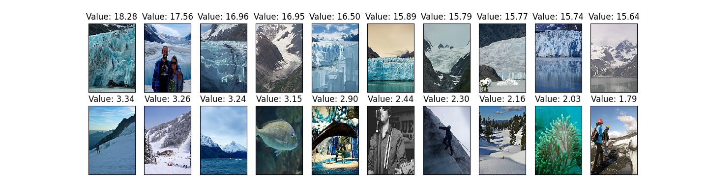
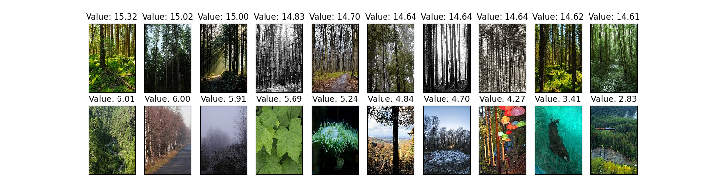
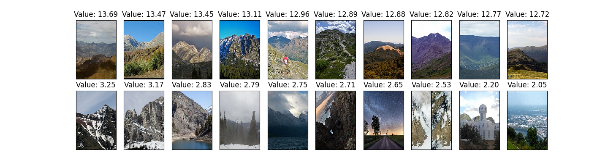
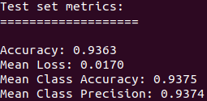
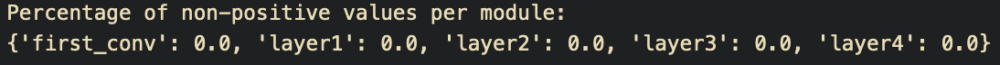
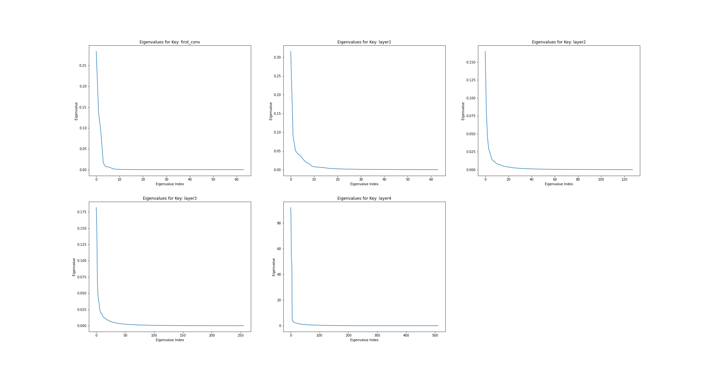
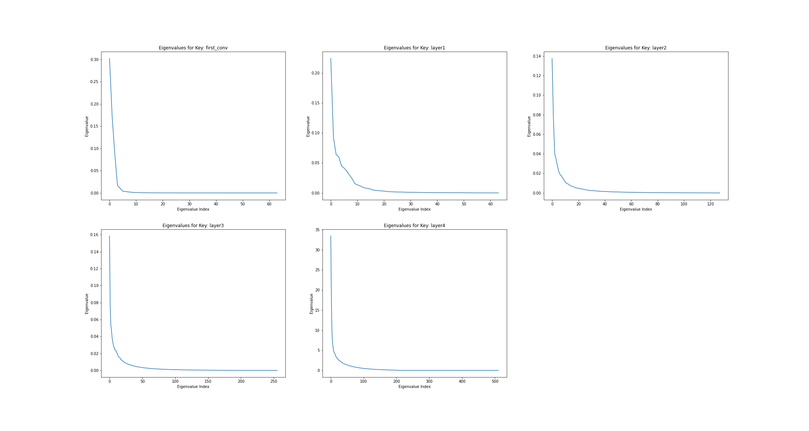
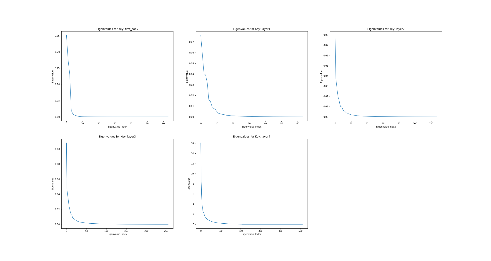

# Task 1

For this task I create the custom dataset MandatoryDataset that returns
items of the form (images, labels, filenames). This is defined in
dataloader.py, along with a Subset class for the stratified splitting. I
define this subset class so that is till have access to the labels and
filenames after splitting. The dataset paths are defined at the top of
the main function in main.py, and it is by default set to ./data in the
delivery folder. A custom dataset is also defined for the ImageNet
dataset.\
\
I then define the function for splitting the dataset, also defined in
dataloader.py as load_splits(), this function then returns dataloaders
for each of the seperate subsets for train/val/split. For checking that
the subsets are disjoint, I define the chech_disjoint() function in
dataloader.py as well.\
\
For the pre-trained network, I chose to use ResNet18, and create a
separate class for the fine-tuning in train.py. The parameters for this
fine-tuning process are defined in main.py as follows:

``` {.python language="python"}
# Fine tune parameters
params = {'model'        : torchvision.models.resnet18(pretrained=True),
          'model_path'   : './new_model.pt',
          'class_n'      : 6,
          'device'       : device,
          'train_loader' : train_loader,
          'val_loader'   : val_loader,
          'epochs'       : 10,
          'lr'           : 0.00002,
          'weight_decay' : 0.001,
          'scheduler'    : 'WarmRestart'
         }

# Fine tune, validate and reproduce
fine_tuned_model = FineTune(params)
fine_tuned_model.train()
```

I tried different parameters through trial and error and ultimately
arrived at the best one listed above. The per class and mean class
metrics are calculated in the evaluate() function in train.py.\
\
The reproduction routine is implemented in the reproduce() function in
train.py, where it uses the current model, whether trained or loaded
from file, and compares it to some previous output saved as a list of
tensors in PATH.

``` {.python language="python"}
def reproduce(self, dataloader, PATH): # PATH to old run
    outputs = torch.load(PATH,  map_location=torch.device(self.device))
    self.model.eval()
    for batch_idx, data in enumerate(dataloader):
        with torch.no_grad():
            inputs = data[0].to(self.device)
            labels = data[1].to(self.device)
            filenames = data[2]

            out = self.model(inputs)
            _, predictions = torch.max(out, dim=1)
            
            out_equal = torch.equal(out, outputs[batch_idx][0]) 
            pred_equal = torch.equal(predictions, outputs[batch_idx][1]) 
            files_equal = filenames == outputs[batch_idx][2]

            assert out_equal and pred_qual and files_equal
    print('All the tensors are equal')
```

The model can be loaded from file using load_final_model() in train.py.
The reproduction function doesn't seem to work when loading the model
from file, however if the model is trained with the same parameters and
compared with the old output tensors from file, it seems to work fine. I
was unable to find the problem in time.\
\
For classes \[1, 2, 3\] $\rightarrow$ \[glacier, mountain, sea\], I get
the following 10 best and worst images for each class respectively.

<figure id="fig:boxplot">

<figcaption>10 best(top row) and 10 worst(bottom row) glacier
images</figcaption>
</figure>

<figure id="fig:boxplot">

<figcaption>10 best(top row) and 10 worst(bottom row) forest
images</figcaption>
</figure>

<figure id="fig:boxplot">

<figcaption>10 best(top row) and 10 worst(bottom row) mountain
images</figcaption>
</figure>

The result for the final test set.

<figure id="fig:boxplot">

<figcaption>Final test set metrics</figcaption>
</figure>

# Task 2

For this section, I chose the following modules from ResNet18: the first
convolutional layer, and the 4 layers following each pair of residual
blocks, named layer1, layer2, layer3 and layer4.

<figure id="fig:boxplot">

<figcaption>Module statistics for task 2</figcaption>
</figure>

This shows that none of the module outputs have negative values, which
is to be expected for ReLU activations.

# Task 3

<figure id="fig:boxplot">

<figcaption>Eigenvalues per layer for the fine-tuned model on the
Mandatory data</figcaption>
</figure>

<figure id="fig:boxplot">

<figcaption>Eigenvalues per layer for the initialized model on the
Mandatory data(no fine-tuning)</figcaption>
</figure>

There seems to be little observable difference between the plots of the
eigenvalues for the initialized model on the mandatory dataset, and the
fine-tuned model on the mandatory dataset.

<figure id="fig:boxplot">

<figcaption>Eigenvalues per layer for the initialized model on the
ImageNet data(no fine-tuning)</figcaption>
</figure>

<figure id="fig:boxplot">

<figcaption>Eigenvalues per layer for the initialized model on the
CIFAR-100 data(no fine-tuning)</figcaption>
</figure>

The plots of the eigenvalues for the other datasets on the initialized
model seem to be more substantial, especially in the layer1.
